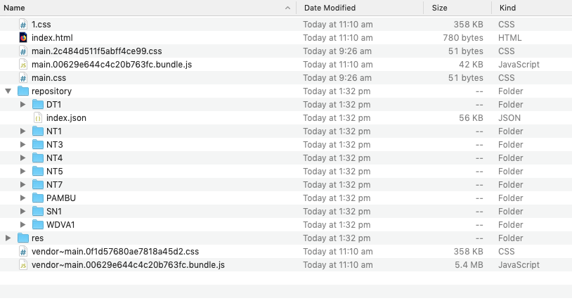

# PARADISEC COLLECTION VIEWER - Mark II

- [PARADISEC COLLECTION VIEWER - Mark II](#paradisec-collection-viewer---mark-ii)
  - [Setup](#setup)
  - [Developing the application](#developing-the-application)
  - [Building a version for deployment](#building-a-version-for-deployment)
    - [Deploying to http://language-archives.services/mobile-viewer/](#deploying-to-httplanguage-archivesservicesmobile-viewer)
    - [Deploying to the PARADISEC data loader](#deploying-to-the-paradisec-data-loader)

This is a collection viewer designed specifically for use on repatriation devices.

It features:

-   modern tooling
-   a modern framework - Vue.js
-   modern styling designed specifically for non technical users and mobile devices

## Setup

You need nodejs installed (version 8 or greater). See [here](https://nodejs.org/en/download/) for what to do for your
system. Once nodejs is setup run `npm install` to install the packages.

## Developing the application

In order to develop the application you will also need https://github.com/marcolarosa/pdsc-librarybox-installer. Download it and set it up as per its instructions then use it to
create a file repository for use with this application.

You will need datafiles from Nabu for this. Basically, start up the app and then use it to target
a `Raspberry Pi` though set the `USB Disk` option to the `dist folder in this repository`. Once complete,
you should see a folder structure similar to the following:



Only the `repository` folder is required. All other folders and files will be removed when
you start the application in development mode as per the following command. Don't worry
about that; that's expected and normal.

```
> npm run develop
```

Then load `http://localhost:9001` in your browser.

## Building a version for deployment

### Deploying to http://language-archives.services/mobile-viewer/

The viewer is deployed to a folder in `/srv/` which is symlinked to `/srv/mobile-viewer`. This folder
is then mounted into the service container and made available via nginx.

```
> npm run build:testing
> ssh language-archives.services
> cd /srv/
> \sudo mkdir mobile-viewer-$(date +%Y%m%d)
> \sudo chown {YOU} mobile-viewer-$(date +%Y%m%d)
> rsync -av --delete dist/ language-archives.services/srv/mobile-viewer/
> \sudo rm /srv/mobile-viewer && lbn -sf mobile-viewer-$(date +%Y%m%d) mobile-viewer
```

### Deploying to the PARADISEC data loader

The viewer is copied in to the folder `src/viewer` replacing the files already there.

```
> npm run build:production
> rsync -av --delete dist/ {path to data loader src code}/src/viewer/
```

Note that the build command is `different` to the one for building a languages-archives version.
